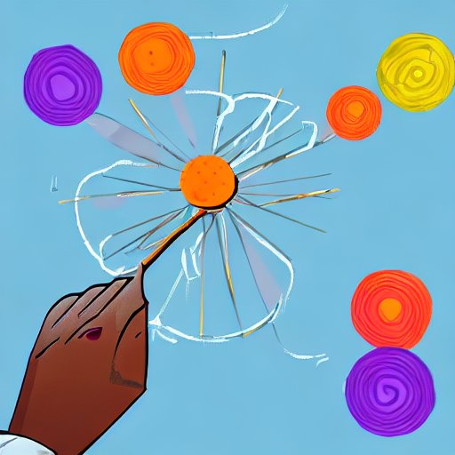

<a name="readme-top"></a>

<!-- PROJECT SHIELDS -->

[![Contributors][contributors-shield]][contributors-url]
[![Forks][forks-shield]][forks-url]
[![Stargazers][stars-shield]][stars-url]
[![Issues][issues-shield]][issues-url]
[![MIT License][license-shield]][license-url]
[![Twitter][twitter-shield]][twitter-url]


<!-- PROJECT LOGO -->
<br />
<div align="center">
  <a href="https://github.com/bk62/spinayarn">
    
  </a>

&nbsp; (<a href="#readme-top">back to top</a>)
<h3 align="center">🧶 Spin A Yarn 💫</h3>

  <p align="center">
    Generate interactive stories with LLMs.
    <!-- <br /> -->
    <!-- <a href="https://github.com/bk62/spinayarn"><strong>Explore the docs »</strong></a> -->
    <br />
    <br />
    <!-- <a href="https://github.com/bk62/spinayarn">View Demo</a>
    · -->
    <a href="https://github.com/bk62/spinayarn/issues">Report Bug</a>
    ·
    <a href="https://github.com/bk62/spinayarn/issues">Request Feature</a>
  </p>
</div>


<!-- TABLE OF CONTENTS -->
<details>
  <summary>Table of Contents</summary>
  <ol>
  <li>
      <a href="#introduction">Introduction</a>
    </li>
    <li>
      <a href="#getting-started">Getting Started</a>
      <ul>
        <li><a href="#prerequisites">Prerequisites</a></li>
        <li><a href="#quickstart">Quickstart</a></li>
      </ul>
    </li>
    <li>
      <a href="#about-the-project">About The Project</a>
      <ul>
        <li><a href="#built-with">Built With</a></li>
      </ul>
       <ul>
        <li><a href="#how-it-works">How It Works</a></li>
      </ul>
       <ul>
        <li><a href="#features">Features</a></li>
      </ul>
       <ul>
        <li><a href="#issues-and-limitations">Issues and Limitations</a></li>
      </ul>
    </li>
    <li><a href="#outline-spec">Outline Spec</a></li>
    <li><a href="#examples">Examples</a></li>
    <li><a href="#llm-models">LLM Models</a></li>
    <li><a href="#roadmap">Roadmap</a></li>
    <li><a href="#license">License</a></li>
  </ol>
</details>


## Introduction

Generate interactive stories from YAML specifciation of short plot outlines.

[![Outline Screen Shot][outline-screenshot]](/examples/abandoned_ship/abandoned_ship.yml)
[![Generated Name Screen Shot][generated-screenshot]](/examples/abandoned_ship/generated/abandoned_ship.hermes.0.twee)
(Generated with Nous Hermes. Rendered in Chapbook.)


<!-- ABOUT THE PROJECT -->


<!-- GETTING STARTED -->
## Getting Started


### Prerequisites

* [poetry][poetry-url]


### Quickstart

1. Clone the repo
   ```sh
   git clone https://github.com/bk62/spinayarn.git
   cd spinayarn
   ```
2. Install packages
   ```sh
   poetry install
   ```
3. Optional. Install llama-cpp-python with cuBLAS.
    ```bash
    poetry run ./scripts/install_llamacpp_python_cublas.sh
    ```
4. Generate! Run with a [YAML story outline spec file](#outline-spec) and any [langchain LLM](https://python.langchain.com/docs/modules/model_io/models/llms/). (Note: The prompts are in Alpaca format currently! ) For example, with LlamaCPP and a Nous Hermes model on your local filesystem:  
   ```python
   from spinayarn import generate_story_from_outline
   from spinayarn.utils import get_llamacpp_llm

   hermes = get_llamacpp_llm(<PATH TO HERMES BIN>)
   generate_story_from_outline(
    "examples/restaurant/restaurant.yml",
    hermes
   )
   ```
   Or,
   ```python
   from spinayarn import InteractiveStory, SpinAYarn
   from spinayarn.utils import get_llamacpp_llm

   hermes = get_llamacpp_llm(<PATH TO HERMES BIN>)
   outline = InteractiveStory.from_outline_yarml("examples/restaurant/restaurant.yml")
   story = spinayarn.generate_story()
   story.to_twee3_file("examples/restaurant/restaurant.twee")
   ```
5. Compile a twine compiler like [tweego](https://www.motoslave.net/tweego/) into a twine story format like [Chapbook](https://klembot.github.io/chapbook/).
    ```bash
    cd examples/restaurant
    tweego -f chapbook-1 -o restaurant.html restaurant.twee
    ```
    (Linux tweego executable in [/twego](/tweego/) for convenience.)
  
6. Play!
    ```bash
    firefox restaurant.html
    ```

More usage examples in [notebooks](/notebooks/).

   


<a href="#llm-models">List of LLM Models</a>
<p align="right">
&nbsp; (<a href="#readme-top">back to top</a>)
</p>

## About The Project


### How It Works
YAML outline specification is parsed, converted into a graph, and all simple paths through the story graph are generated.
Then, by walking through all those paths and iteratively fed into an LLM through a WIP prompt in order to cumulatively generate text.
The goal in all this is to, IDEALLY, get story text that is path dependent.

E.g. If you choose to pick up a sword instead of a bow in a previous page, the text generated by the LLM should reflect that in later text.

In practice, getting the text to be perfect is difficult to say the least. Requires a lot of trial and error!

<p align="right">(<a href="#readme-top">back to top</a>)</p>

### Features

- Specify story outlines in YAML Files
- Generate all simple paths (no repeating nodes) through the story
- Generate path dependent story text using any langchain LLM
- Export to JSON or Twine's Twee formats

<p align="right">(<a href="#readme-top">back to top</a>)</p>

### Issues and Limitations

- Prompt design and engineering: improvements needed!
- Text generated by the OpenSource LLMs I tested were not always exactly to intended specification. E.g. third person when specifying first person, or not the specified length etc.
- Can be extremely slow, depending on the size of the story and the number of simple paths through it! (`O(n!)`)

<p align="right">(<a href="#readme-top">back to top</a>)</p>


### Built With

* [langchain][langchain-url]
* [networkx](https://networkx.org)


<p align="right">(<a href="#readme-top">back to top</a>)</p>


## Outline Spec

A YAML spec for specifying interactive story outlines.

TODO


### Example Outlines

  ```YAML
  story_outline:
    title: Abandoned Ship
    pov: third person
    setting: ancient abandoned ship in an asteroid belt
    nodes:
      start:
        plot: Derek, a space miner, finds an abandoned ship. ship looks like ancient human tech
        links:
          closer: get closer
      closer:
        plot: he sees that the hull says NASA Hermes Mission 2500. He searches for a door, finds two locked ones.
        links:
          door1: enter door 1
          door2: enter door 2
      door1:
        plot: big explosion. luckily Derek is rescued by other miners. ship wreck is lost.
      door2:
        plot: He finds a working ancient databank. Archaeologists in the nearest university thank Derek.
  ```


Refer to [examples](/examples) for example outlines.

<!-- USAGE EXAMPLES -->
## Examples

<!-- Use this space to show useful examples of how a project can be used. Additional screenshots, code examples and demos work well in this space. You may also link to more resources. -->

TODO

Refer to [examples](/examples) for stories generated from example outlines.


<p align="right">(<a href="#readme-top">back to top</a>)</p>


<!-- LLM Models -->
<a name="llm-models"></a>

## LLM Models

I have only tested these only with the following LlamaCPP compatible models.

There are some example notebooks in `/notebooks`.

<p align="">
Refer to <a href="#roadmap">Roadmap</a>.
</p>


### Downloading with HuggingFaceHub

```python
   from huggingface_hub import hf_hub_download

   const REPO_ID = 'REPO ID';
   const MODEL_FILENAME = 'Model Filename';
   model_filepath = hf_hub_download(REPO_ID, MODEL_FILENAME)
   ```


### LlamaCPP Models

#### Nous Hermes

[Official](https://huggingface.co/NousResearch/Nous-Hermes-13b)

[GGML](https://huggingface.co/TheBloke/Nous-Hermes-13B-GGML)


#### Chronos Hermes

[Official](https://huggingface.co/Austism/chronos-hermes-13b)

[GGML](https://huggingface.co/TheBloke/chronos-hermes-13B-GGML)


<!-- ROADMAP -->
<a name="roadmap"></a>

## Roadmap

- [ ] Prompt design through trial and error
- [ ] Interactively confirm/edit prompts/generated node text in notebooks
- [ ] Prompts in non-Alpaca formats
- [ ] ggml
    - [ ] MPT-7B StoryWriter
- [ ] ChatGPT

See the [open issues](https://github.com/bk62/spinayarn/issues) for a full list of proposed features (and known issues).

<p align="right">(<a href="#readme-top">back to top</a>)</p>


<!-- LICENSE -->
## License

Distributed under the MIT License. See `LICENSE.txt` for more information.

<p align="right">(<a href="#readme-top">back to top</a>)</p>


<!-- MARKDOWN LINKS & IMAGES -->
<!-- https://www.markdownguide.org/basic-syntax/#reference-style-links -->
[contributors-shield]: https://img.shields.io/github/contributors/bk62/spinayarn.svg?style=for-the-badge
[contributors-url]: https://github.com/bk62/spinayarn/graphs/contributors
[forks-shield]: https://img.shields.io/github/forks/bk62/spinayarn.svg?style=for-the-badge
[forks-url]: https://github.com/bk62/spinayarn/network/members
[stars-shield]: https://img.shields.io/github/stars/bk62/spinayarn.svg?style=for-the-badge
[stars-url]: https://github.com/bk62/spinayarn/stargazers
[issues-shield]: https://img.shields.io/github/issues/bk62/spinayarn.svg?style=for-the-badge
[issues-url]: https://github.com/bk62/spinayarn/issues
[license-shield]: https://img.shields.io/github/license/bk62/spinayarn.svg?style=for-the-badge
[license-url]: https://github.com/bk62/spinayarn/blob/master/LICENSE.txt
[twitter-shield]: https://img.shields.io/badge/-Twitter-black.svg?style=for-the-badge&logo=twitter&colorB=555
[twitter-url]: https://twitter.com/celeritatem
[outline-screenshot]: images/as_start_outline.png
[generated-screenshot]: images/as_start_generated.png
[langchain-url]: https://github.com/hwchase17/langchain
[poetry-url]: https://python-poetry.org/docs/#installation